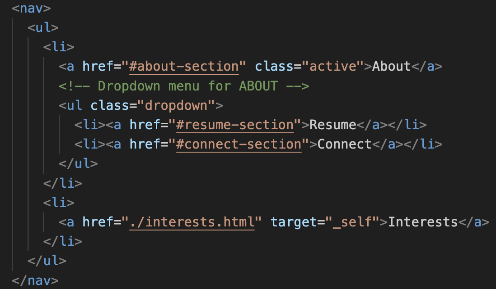

For this website, there were definitely challenges that I faced but overall, it was super fulfilling to build out in the end.

Process:

- For my final project proposal, I mentioned that I wanted to simplify my page.

  - I combined my resume and connect pages from my midterm all into the homepage.
  - I then created a dropdown menu for those sections.
    , 
    - As I already have my header display flex, the menu items are already on the side that I want.
    - The codes I provided above styles it so that the "About" and "Interests" links are centered within the overall list (ul) tag.
    - I also have set a green background when you hover over the menu items to add some effect.

- I then worked on my resume section of the homepage

  - This was very challenging as I didn't have a clear idea in mind on how I wanted to style it.
  - I gained inspiration from this website: https://optimismvc.webflow.io/portfolio.
    
  - I separated each experience into being individual row and then within that row, there exists the table cell elements for information that I want to include.

- An interesting piece of code that I was able to implement was my signature animation.

  - I was able to watch a YouTube video that showed me how to implement what I envisioned.
  - Essentially, I had to redraw my signature and export it as a vector (svg) in Canva.
    
    - It turned out to be a relatively intuitive process, in which you offset the original image by a certain amount and then transition it back to the normal state.

- I also had a tough time navigating on how to implement the hamburger menu icon on mobile displays.

  - I had to write some javascript functions to ensure it functions as I wanted.
    
  - The first 2 event listeners wait for the user to click on the menu icon. Once clicked, it will turn the hamburger-menu-content active, and if clicked again, will remove the active class.
  - The active class is to simply display the content on the screen.
  - However, I realized that the menu was still not being closed properly. The third function ensures that each of my anchor elements inside the hamburger-menu-content is truly not active (displayed).

Next steps:

- If I had more time, I want to work more on my interests page.
- I came up with a gallery idea last minute, and thus want to further expand upon it.
- I am thinking of ways to make it more dynamic and interactive.
  - Maybe having a filter option of sorts so that I can categorize my images. For example, family & friends, dogs, travel, etc.
- After the presentation, I also thought about implementing smooth scrolling to add in the final touch.
- I'm also thinking of some privacy issues and how I can protect certain images that I post.
